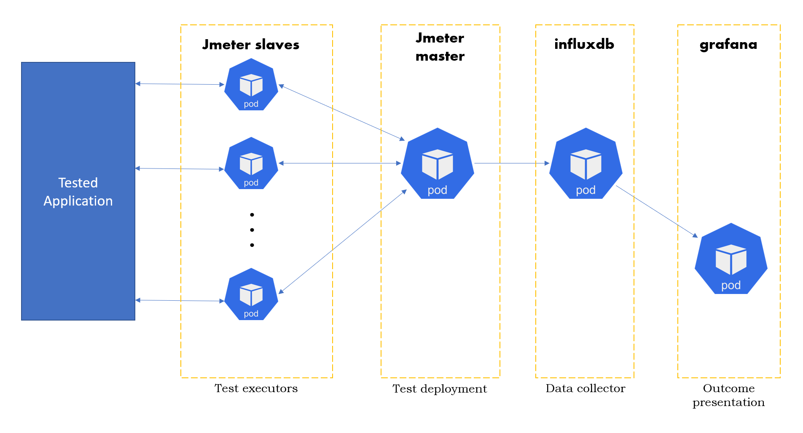

## jmeter-kubernetes
Load Test as a service (LTaaS)

The service is dedicated to run in kubernetes cluster
and is based on Apache JMeter Distributed Testing schema.

##

##
Detailed description how to begin with initial AWS setup and install necessary tools to be able to start adventure with kubernetes can be found in [Initial Instruction Manual](https://github.com/adku44/jmeter-kubernetes/blob/main/doc/initial-instruction-manual.md)

Basic information how to use kubernetes and adjust kubernetes environment for LTaaS can be found in [k8s Instruction Manual](https://github.com/adku44/jmeter-kubernetes/blob/main/doc/k8s-instruction-manual.md). Also description of handling Load Test applicaton is covered by this manual. 

Troubleshooting [guide](https://github.com/adku44/jmeter-kubernetes/blob/main/doc/hints.md)

Workshops [plan](https://github.com/adku44/jmeter-kubernetes/blob/main/doc/workshops.md)